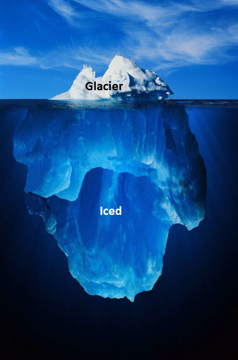

# Glacier

Glacier is a high level wrapper around [Iced](https://github.com/icedland/iced) which provides helper methods and unified APIs to abstract away architectural details.

This library is very experimental and is mostly looking to explore alternate design patterns which use Rust's type system to enforce library requirements rather than checking at runtime and panicking.
